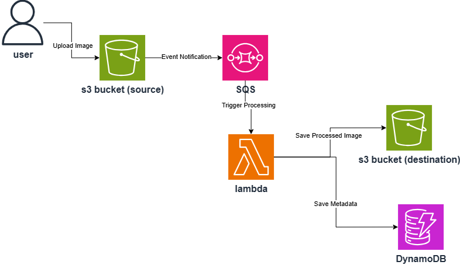

# Serverless Image Processing Pipeline



[](https://aws.amazon.com/)
[](https://www.python.org/)
[](https://www.terraform.io/)
[](LICENSE)

An event-driven, production-grade serverless architecture built on Amazon Web Services (AWS) designed to automate image ingestion, resizing, watermarking, and metadata extraction at scale.

---

## 📌 Table of Contents
- [Solution Overview](#-solution-overview)
- [Architecture & Data Flow](#-architecture--data-flow)
- [AWS Services Used](#-aws-services-used)
- [Repository Structure](#-repository-structure)
- [Lambda Processing Logic](#-lambda-processing-logic)
- [Infrastructure as Code (Terraform)](#-infrastructure-as-code-terraform)
- [Deployment & Local Testing](#-deployment--local-testing)
- [Cost Optimization & Scaling](#-cost-optimization--scaling)
- [Future Enhancements](#-future-enhancements)

---

## 💡 Solution Overview

Modern web applications require fast, automated, and decoupled media processing pipelines. Processing large images synchronously on a traditional server creates performance bottlenecks and increases operational costs.

This project solves this challenge by leveraging **AWS Serverless services** to create an asynchronous, event-driven image processing engine:
- **Zero Server Management:** Fully managed by AWS compute and storage services.
- **Asynchronous Decoupling:** SQS prevents traffic spikes from overwhelming downstream execution.
- **Cost Efficient:** Pay-per-use model with zero idle running costs.

---

## 📐 Architecture & Data Flow

1. **Upload:** A user or client application uploads an original image file (`.jpg`/`.png`) to the **Source S3 Bucket** (`s3-source-image-uploads`).
2. **Notification:** S3 triggers an `ObjectCreated` event notification and sends a message containing file details to **Amazon SQS**.
3. **Queue & Trigger:** Amazon SQS buffers the event message and triggers the **AWS Lambda Function** asynchronously using event source mapping.
4. **Execution & Resizing:** The **AWS Lambda** function retrieves the image, performs processing (resizing, optimization, watermarking), and writes the output file to the **Destination S3 Bucket** (`s3-processed-images-output`).
5. **Metadata Storage:** Lambda records image metadata (Image ID, Source, Size, Timestamp, Status) into an **Amazon DynamoDB Table** (`ImageMetadataTable`).

---

## 🛠️ AWS Services Used

| Service | Category | Role in Architecture |
| :--- | :--- | :--- |
| **Amazon S3 (Source)** | Object Storage | Stores raw uploaded user images and emits S3 Event Notifications. |
| **Amazon SQS** | Application Integration | Message queue that buffers image upload events to ensure fault tolerance. |
| **AWS Lambda** | Serverless Compute | Executes Python code to process images and store metadata on demand. |
| **Amazon S3 (Destination)** | Object Storage | Stores final processed, resized, and watermarked image assets. |
| **Amazon DynamoDB** | NoSQL Database | Stores key-value metadata records for fast indexing and querying. |
| **AWS IAM** | Security & Governance | Manages Least Privilege roles and access policies across all services. |

---

## 📂 Repository Structure

```text
aws-serverless-image-processing/
├── README.md                      # Comprehensive Project Documentation
├── architecture-diagram.png       # Draw.io Architectural Diagram
├── src/
│   └── lambda_function.py         # AWS Lambda Python Handlers & Logic
└── terraform/
    └── main.tf                    # Infrastructure as Code (IaC) Provisioning
```

---

## ⚡ Lambda Processing Logic

The core processing logic is located in `src/lambda_function.py`. It handles event parsing, mock image processing workflows, and metadata persistent logging.

```python
import json
import urllib.parse
import boto3
import os

s3_client = boto3.client('s3')
dynamodb = boto3.resource('dynamodb')

DESTINATION_BUCKET = os.environ.get('DESTINATION_BUCKET', 's3-processed-images-output')
METADATA_TABLE = os.environ.get('METADATA_TABLE', 'ImageMetadataTable')

def lambda_handler(event, context):
    """
    AWS Lambda handler triggered by SQS containing S3 event notifications.
    """
    for record in event['Records']:
        sqs_body = json.loads(record['body'])
        
        if 'Records' in sqs_body:
            for s3_record in sqs_body['Records']:
                source_bucket = s3_record['s3']['bucket']['name']
                object_key = urllib.parse.unquote_plus(s3_record['s3']['object']['key'], encoding='utf-8')
                file_size = s3_record['s3']['object']['size']
                
                print(f"[INFO] Processing image: {object_key} from bucket: {source_bucket}")
                
                # Processing simulation (Resizing / Watermarking)
                processed_key = f"processed-{object_key}"
                
                # Persist Metadata to DynamoDB
                table = dynamodb.Table(METADATA_TABLE)
                table.put_item(
                    Item={
                        'ImageId': object_key,
                        'SourceBucket': source_bucket,
                        'DestinationBucket': DESTINATION_BUCKET,
                        'OriginalSizeBytes': file_size,
                        'Status': 'PROCESSED'
                    }
                )
                print(f"[SUCCESS] Metadata for {object_key} written to DynamoDB.")

    return {
        'statusCode': 200,
        'body': json.dumps('Image processing pipeline executed successfully!')
    }
```

---

## 🏗️ Infrastructure as Code (Terraform)

All resources can be provisioned automatically using Terraform scripts provided in `terraform/main.tf`:

```hcl
provider "aws" {
  region = "us-east-1"
}

resource "aws_s3_bucket" "source" {
  bucket = "s3-source-image-uploads"
}

resource "aws_s3_bucket" "destination" {
  bucket = "s3-processed-images-output"
}

resource "aws_sqs_queue" "image_queue" {
  name                       = "s3-event-notification-queue"
  delay_seconds              = 0
  message_retention_seconds  = 86400
}

resource "aws_dynamodb_table" "metadata" {
  name         = "ImageMetadataTable"
  billing_mode = "PAY_PER_REQUEST"
  hash_key     = "ImageId"

  attribute {
    name = "ImageId"
    type = "S"
  }
}
```

---

## 🚀 Deployment & Local Testing

### Prerequisites
- Python 3.11+
- AWS CLI & Terraform installed (Optional for IaC)
- Visual Studio Code or IDE of choice

### Local Steps
1. Clone the repository:
   ```bash
   git clone https://github.com/ziadessamx-hash/aws-serverless-image-processing.git
   cd aws-serverless-image-processing
   ```
2. Inspect the architecture in `architecture-diagram.png`.
3. Review lambda function code inside `src/lambda_function.py`.

---

## 💰 Cost Optimization & Scaling

- **S3 Lifecycle Rules:** Move raw uploaded images to S3 Glacier after 30 days.
- **DynamoDB On-Demand:** Eliminates capacity planning costs by charging strictly per request.
- **SQS Dead Letter Queue (DLQ):** Captures failed image executions for retry mechanisms without repeating Lambda invocations.

---

## 📝 License
This project is released under the MIT License.